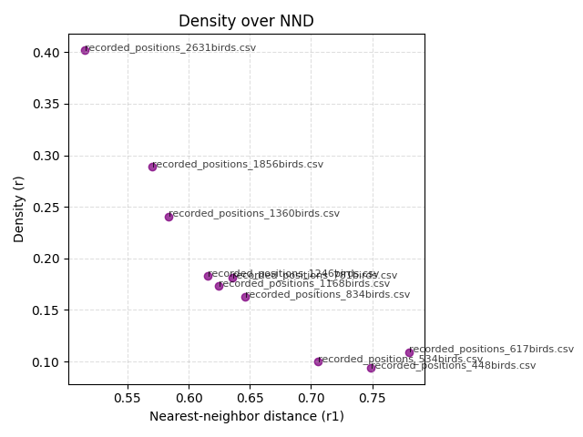
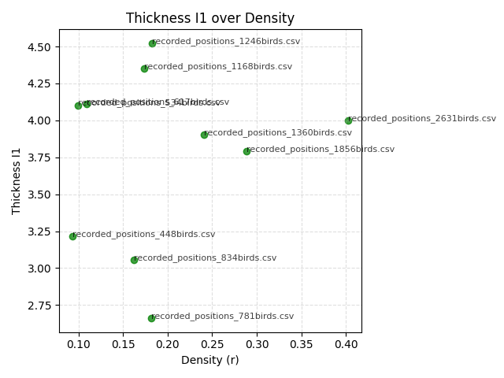

# Achieved goals, test results and analysis

Overall, we managed partialy to reach seeked goals. Visually, the model forms a flock that, although somewhat reminiscent of the murmurations of flocks of starlings, could not be achieved with a fully democratic model.

A simplified multi-agent reinforcement learning (MARL) environment was implemented to model collective flocking behavior. Each agent represents a single bird moving in a three-dimensional space and observes only local information, consisting of its own velocity, the average relative position of neighboring birds, and their average velocity. Agents control changes in their velocity vector, allowing them to adjust their movement based on local interactions. The reward function encourages the emergence of realistic flocking behavior by optimizing three key properties: maintaining a target nearest-neighbor distance (cohesion), maintaining a target flight speed, and aligning movement direction with neighboring birds (polarity). Compared to the full project specification, the current implementation focuses on these core flocking mechanisms and serves as a computationally efficient baseline for further development and integration of additional geometric and structural flock metrics.

## Tests

As part of the tests, metrics were calculated, compared with empirical data, and graphs were generated that should coincide with the graphs from the article.

Metrics generated form model:

| source_file                      | number_of_birds | volume_m3 | density_r | nnd_r1 | velocity_m_s | concavity | balance_shift | thickness_I1 | I2_I1 | I3_I1 | I1_G | V_G  | V_I1 |
|----------------------------------|-----------------|-----------|-----------|--------|--------------|-----------|---------------|--------------|-------|-------|------|------|------|
| recorded_positions_1168birds.csv | 1168.0          | 6755.76   | 0.17      | 0.62   | 0.3          | 0.86      | -0.07         | 4.35         | 1.29  | 1.64  | 0.44 | 0.26 | 0.64 |
| recorded_positions_1246birds.csv | 1246.0          | 6843.24   | 0.18      | 0.62   | 0.42         | 0.74      | -0.03         | 4.52         | 1.25  | 1.57  | 0.44 | 0.19 | 0.4  |
| recorded_positions_1360birds.csv | 1360.0          | 5960.56   | 0.24      | 0.58   | 0.3          | 0.58      | 0.1           | 3.9          | 1.52  | 1.84  | 0.32 | 0.26 | 0.69 |
| recorded_positions_1856birds.csv | 1856.0          | 6481.67   | 0.29      | 0.57   | 0.49         | 0.82      | -0.02         | 3.79         | 1.31  | 1.64  | 0.08 | 0.22 | 0.81 |
| recorded_positions_2631birds.csv | 2631.0          | 6684.12   | 0.4       | 0.51   | 0.19         | 0.8       | 0.02          | 4.0          | 1.38  | 1.67  | 0.24 | 0.9  | 0.31 |
| recorded_positions_448birds.csv  | 448.0           | 5062.4    | 0.09      | 0.75   | 0.63         | 0.6       | -0.07         | 3.22         | 1.8   | 2.31  | 0.3  | 0.0  | 0.6  |
| recorded_positions_534birds.csv  | 534.0           | 5560.46   | 0.1       | 0.71   | 0.54         | 0.6       | -0.04         | 4.1          | 1.42  | 1.67  | 0.14 | 0.18 | 0.7  |
| recorded_positions_617birds.csv  | 617.0           | 5686.08   | 0.11      | 0.78   | 0.41         | 0.64      | -0.06         | 4.11         | 1.3   | 1.6   | 0.19 | 0.06 | 0.69 |
| recorded_positions_781birds.csv  | 781.0           | 4528.63   | 0.18      | 0.64   | 0.41         | 0.74      | 0.05          | 2.66         | 2.01  | 2.56  | 0.16 | 0.43 | 0.67 |
| recorded_positions_834birds.csv  | 834.0           | 5342.68   | 0.16      | 0.65   | 0.38         | 0.48      | 0.03          | 3.06         | 1.66  | 2.21  | 0.08 | 0.05 | 0.87 |

Epirical data:

| Flocking event | Number of birds | Volume (m3) | Density r (m^-3) | NND r1 (m) | Velocity (m/s) | Concavity | Balance shift | Thickness I1 (m) | I2/I1 | I3/I1 | I1-G | V-G  | V-I1 |
|----------------|-----------------|-------------|------------------|------------|----------------|-----------|---------------|------------------|-------|-------|------|------|------|
| 32-06          | 781             | 930         | 0.80             | 0.68       | 9.6            | 0.03      | 0.08          | 5.33             | 2.97  | 4.02  | 0.89 | 0.06 | 0.20 |
| 28-10          | 1246            | 1840        | 0.54             | 0.73       | 11.1           | 0.34      | -0.06         | 5.29             | 3.44  | 6.93  | 0.80 | 0.09 | 0.41 |
| 25-11          | 1168            | 2340        | 0.38             | 0.79       | 8.8            | 0.37      | -0.10         | 8.31             | 1.90  | 5.46  | 0.92 | 0.12 | 0.14 |
| 25-10          | 834             | 2057        | 0.34             | 0.87       | 12.0           | 0.05      | 0.00          | 6.73             | 2.65  | 4.98  | 0.99 | 0.18 | 0.18 |
| 21-06          | 617             | 2407        | 0.24             | 1.00       | 11.2           | 0.04      | 0.00          | 7.23             | 2.56  | 4.53  | 0.96 | 0.09 | 0.11 |
| 29-03          | 448             | 2552        | 0.13             | 1.09       | 10.1           | 0.20      | 0.00          | 6.21             | 3.58  | 5.96  | 0.97 | 0.27 | 0.06 |
| 25-08          | 1360            | 12646       | 0.09             | 1.25       | 11.9           | 0.19      | 0.16          | 11.92            | 3.32  | 5.12  | 0.95 | 0.14 | 0.12 |
| 17-06          | 534             | 5465        | 0.08             | 1.30       | 9.1            | 0.18      | 0.50          | 9.12             | 2.76  | 6.94  | 0.91 | 0.09 | 0.32 |
| 16-05          | 2631            | 28128       | 0.06             | 1.31       | 15.2           | 0.15      | 0.00          | 17.14            | 2.46  | 8.36  | 0.90 | 0.19 | 0.25 |
| 31-01          | 1856            | 33487       | 0.04             | 1.51       | 6.9            | 0.24      | 0.17          | 19.00            | 2.44  | 4.07  | 0.95 | 0.09 | 0.13 |

## Conclusions

The obtained results indicate that the proposed MARL-based flocking model successfully reproduces several fundamental characteristics of collective motion. In particular, the model consistently maintains nearest-neighbor distances within the same order of magnitude as those observed in empirical data and produces cohesive groups exhibiting strong directional alignment. The generated flocks also display visually recognizable flocking patterns resembling natural bird aggregations.

However, the comparison with real-world measurements reveals significant discrepancies in several global structural properties. The simulated flocks are considerably denser than empirical starling flocks, resulting in substantially smaller volumes for a given number of birds. Average velocities are also much lower than those observed in nature, primarily because realistic flight dynamics were not explicitly incorporated into the environment and reward function.

The largest differences can be observed in geometric metrics such as concavity, aspect ratios (I2/I1 and I3/I1), and orientation parameters. Real starling murmurations often form highly elongated and dynamically changing shapes, whereas the learned policy tends to generate more compact and isotropic structures. This suggests that optimizing only nearest-neighbor distance, velocity, and polarity is insufficient to reproduce the full complexity of natural flock geometry.

The results confirm the initial observation that a fully democratic model, where all agents follow the same local policy and no bird has a special role, can reproduce basic flock cohesion and alignment but struggles to generate the large-scale structures characteristic of real murmurations. This is consistent with previous findings that realistic flock morphology emerges from a combination of local interactions, environmental constraints, and additional behavioral mechanisms that were not included in the simplified model.

Despite these limitations, the project achieved its primary objective of creating a scalable multi-agent reinforcement learning framework capable of generating stable flocking behavior for populations ranging from approximately 400 to 2700 agents. The implementation provides a computationally efficient baseline that can be extended in future work.

Several directions for future improvements can be identified:

- extending the reward function with additional geometric metrics used in the empirical dataset,
- incorporating realistic flight dynamics and acceleration constraints,
- introducing adaptive neighborhood selection mechanisms,
- adding environmental influences such as predators, wind, or navigation targets,
- exploring hierarchical or partially leader-based interaction models,
- performing longer training runs and more extensive hyperparameter optimization.

Overall, the project demonstrates that reinforcement learning can successfully learn local flocking rules that generate coherent collective behavior. While the current model does not fully reproduce the geometric complexity of natural starling murmurations, it establishes a solid foundation for further research into biologically realistic collective motion using multi-agent reinforcement learning.