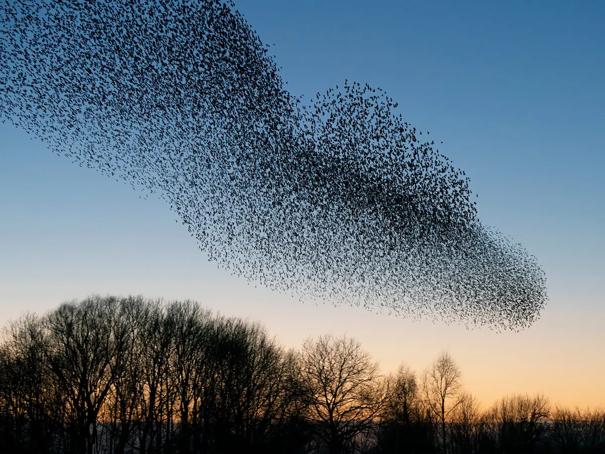
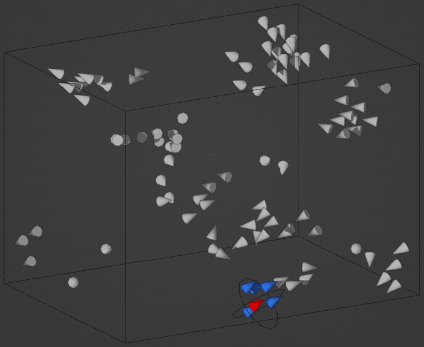

# Problem and domain analysis

## Overview
The projects goal is to simulate the murmuration of the flock of 
[European Starling](#starling-murmuration).
This can be achieved by implementing [Boids](#boids) model with additional
constraints, such as limiting the number of neighbors used to update the 
birds position on the simulations step.
Additionally, several tools used to implement such model already [exist](#tools).

To validate the simulation it can be compared to existing data on starling murmuration.

Literature and other resources prepared for this project are presented in the 
[bibliography](#bibliography) at the end of this document.

## Detailed analysis
This section discusses the project in more detail, starting with 
the explanation of the Starling behavior.

### Starling murmuration

The European starling forms flocks consisting of massive numbers of birds. During migration, common starlings can fly at speeds of 60–80 km/h. Starling flocks move as a collective in seemingly random directions and without a clear leader.

A murmuration is a flock of 500 or more starlings (sometimes even thousands) that typically gather as they approach their roosting site. Smaller flocks travel from different directions and gradually merge with one another until they form one large, dynamic flock.

Within a murmuration, starlings swirl and swoop together, rapidly changing direction and creating constantly shifting shapes. The sharp pushing, pulling, diving, pulsating, and swooping of the flock — driven by individual movements — can confuse and discourage predators such as falcons, providing collective protection.

When responding to predators, murmurations exhibit a range of coordinated escape patterns that emerge from local interactions between individuals. These include collective turns, where large portions of the flock rapidly change direction; splits, in which the flock divides into subgroups; and compacting, where birds move closer together to reduce individual exposure. At the individual level, starlings evade predators through manoeuvres such as level turns, dives, and diving turns, adjusting both direction and altitude relative to the threat.

However, each bird does not track every other bird in the flock. Instead, it follows roughly its seven closest neighbors. By coordinating with these nearest neighbors, starlings can maintain the characteristic structure of the flock with minimal effort. When uncertainty in sensing is present, interacting with six or seven neighbors optimizes the balance between group cohesiveness and individual effort.
Empirical studies[^1] [^5] show that this number is not arbitrary: interacting with around 6–7 neighbors maximizes robustness per neighbor — a balance between maintaining group cohesion and minimizing the cost of processing information. Too few neighbors lead to a disconnected interaction network, while too many reduce efficiency without significantly improving collective stability. Importantly, this optimal number depends more on the flock’s geometry (e.g., thickness) than on its total size.

Each starling also maintains a safe distance from its nearest neighbors. When a bird at the edge of the flock changes direction, that shift propagates through the flock as nearby birds adjust their movement in response.

In practice, individual birds respond to only three main aspects of flight — their own movement and that of nearby birds. These factors are often described as:

- **Attraction zone**: “In this area, you move toward the next bird.”
- **Repulsion zone**: “You avoid flying directly into another bird’s path, otherwise both would lose stability.”
- **Angular alignment**: “You adjust your direction to match that of your neighbor.”

### Boids

Boids is an artificial life program developed by Craig Reynolds in 1986 that simulates the flocking behavior of birds and other forms of group motion. Instead of controlling the behavior of an entire flock as a single entity, the Boids model defines a set of simple rules that govern the behavior of each individual bird.

Despite the simplicity of these rules, the simulation produces complex and realistic collective motion. Because of this, the model has been widely used in computer graphics, particularly for computer-generated behavioral animation in motion pictures.

In the Boids model, each bird (called a "boid") is represented as an object with its own position, velocity, and orientation. The behavior of each boid is governed by three basic rules:

- **Separation** – each bird attempts to maintain a reasonable distance from nearby birds in order to avoid crowding.
- **Alignment** – birds try to adjust their direction so that it matches the average direction of nearby birds.
- **Cohesion** – each bird attempts to move toward the average position of nearby birds.

## Problem of simulating a flock of starlings

#### Mapping Biological Rules to the Boids Model

A key challenge is translating the biologically observed interaction rules — attraction zone, repulsion zone, and angular alignment — into the classical Boids framework defined by cohesion, separation, and alignment (introduced by Craig Reynolds).

#### The Neighborhood Definition Problem

A critical discrepancy between standard Boids and real starling behavior lies in how “neighbors” are defined:

 - In the classical Boids model:
     - Neighborhoods are metric — all agents within a fixed radius are considered neighbors.
 - In real starling flocks:
     - Neighborhoods are topological — each bird interacts with approximately 6–7 nearest neighbors, regardless of physical distance.

#### Generating Murmurations

In a basic Boids simulation, motion tends to stabilize into smooth, homogeneous flocking. However, real murmurations exhibit rapid directional changes and internal waves and ripples.

To achieve this, additional mechanisms must be introduced:

 - Delayed reactions

Birds do not respond instantaneously; introducing latency in updating velocity or direction can create wave-like propagation effects.

 - Stochastic perturbations (noise)

Small random variations in movement can prevent over-stabilization and help generate complex, dynamic patterns.

 - Local amplification of changes

Small directional changes at the edge of the flock should propagate through neighbor interactions, creating emergent waves across the entire system.

#### Flock Reaction to a Predator[^4]

Modeling predator response requires dynamic modification of standard Boids 
rules. Instead of maintaining cohesion and alignment, birds near the threat should prioritize escape behavior.

Individuals that detect the predator — or observe sudden changes in their nearest neighbors — should:
- move in the opposite direction of the threat,
- exhibit zigzag motion to reduce predictability,
- temporarily increase separation to avoid collisions.

## Tools

 - ["Advanced Murmuration Simulation"](https://github.com/Alex-Scott-NZ/Murmuration#)

 - ["Experiment with 3D Boids and JavaScript"](https://ercangercek.medium.com/experiment-with-3d-boids-and-javascript-fe8fa51707b8)

 - various libraries for different languages (e.g [python boids](https://github.com/SverreNystad/boids-in-python))

---

## Bibliography
[^1]: [Starling Flock Networks Manage Uncertainty in Consensus at Low Cost](https://journals.plos.org/ploscompbiol/article?id=10.1371/journal.pcbi.1002894#abstract0)

[Starlings: Mapping and modelling the ballet of the skies](https://www.bbc.com/news/science-environment-29599792)

[Animating murmurations of starlings](https://vanhunteradams.com/Pico/Animal_Movement/Boids_Lab.html)

[^4]: [Mechanisms driving collective escape patterns in starling flocks](https://www.biorxiv.org/content/10.1101/2024.10.27.620514v3)

[^5]: [Starlings Coordinate Movements Within a Flock](https://asknature.org/strategy/starlings-coordinate-movements-within-a-flock/)

Timm Wong, Boids, url: https://cs.stanford.edu/people/eroberts/courses/soco/projects/2008-09/modeling-natural-systems/boids.html

Ray Mairlot, Boids, url: https://www.raymairlot.co.uk/blog/boids.html
